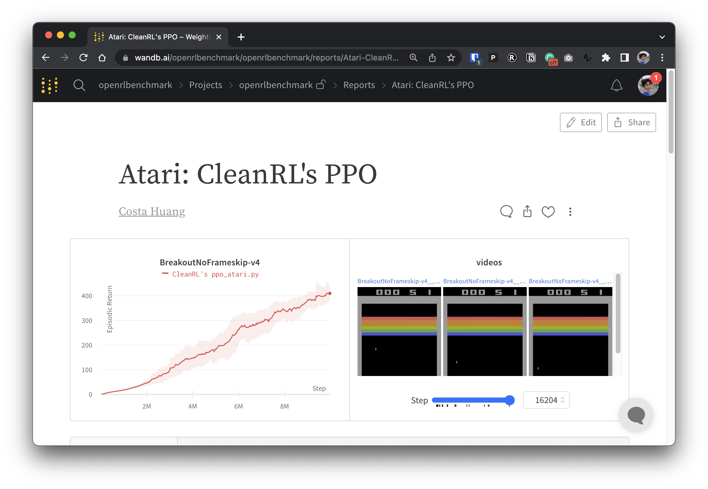
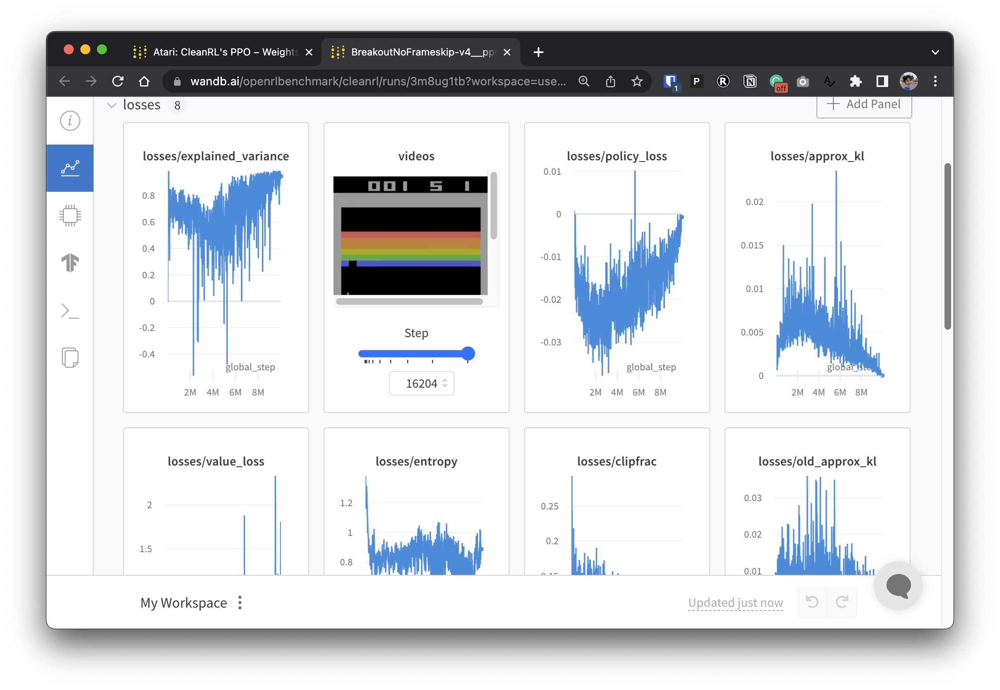
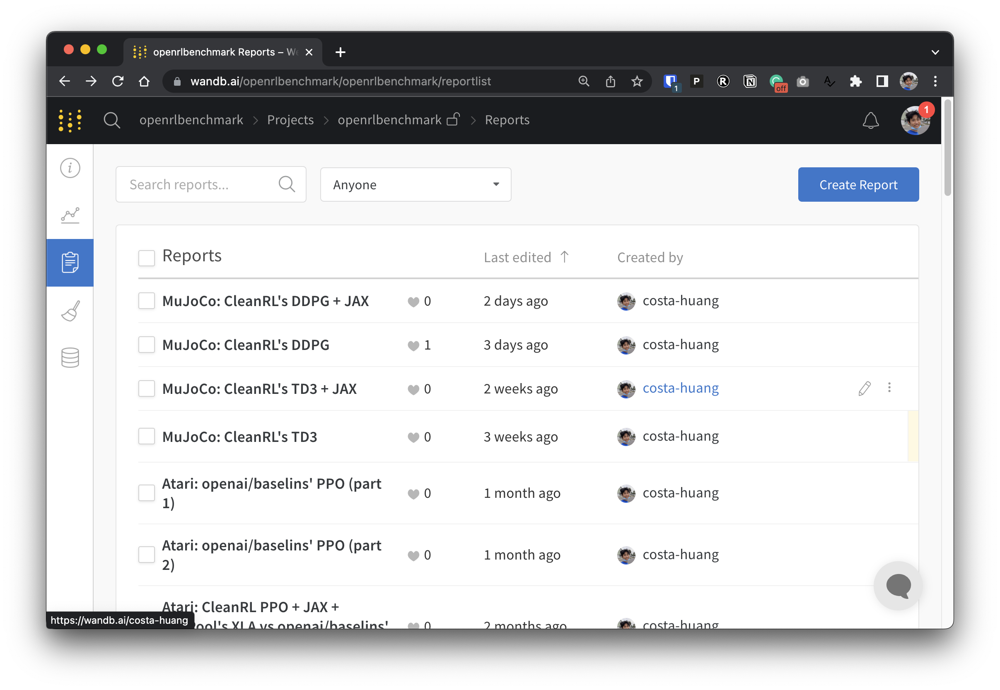

<br />
<p align="center">
    <a href="https://github.com/mosaicml/composer#gh-light-mode-only" class="only-light">
      
    </a>
    <!-- SETUPTOOLS_LONG_DESCRIPTION_HIDE_BEGIN -->
    <a href="https://github.com/mosaicml/composer#gh-dark-mode-only" class="only-dark">
      
    </a>
    <!-- SETUPTOOLS_LONG_DESCRIPTION_HIDE_END -->
</p>

<h2><p align="center">Clean Implementation of RL Algorithms</p></h2>
<!-- <h3><p align="center">Train Faster, Reduce Cost, Get Better Models</p></h3> -->

<h4><p align='center'>
<a href="https://cleanrl.dev">[Website]</a>
- <a href="https://docs.cleanrl.dev/get-started/installation/">[Getting Started]</a>
- <a href="https://docs.cleanrl.dev/">[Docs]</a>
<!-- - <a href="https://docs.mosaicml.com/en/stable/method_cards/methods_overview.html">[Methods]</a>
- <a href="https://cleanrl.dev/team">[We're Hiring!]</a> -->
</p></h4>

<p align="center">
    <a href="https://pypi.org/project/mosaicml/">
        
    </a>
    <a href="https://pypi.org/project/mosaicml/">
        
    </a>
    <a href="https://pypi.org/project/mosaicml/">
        
    </a>
    <a href="https://docs.mosaicml.com/en/stable/">
        
    </a>
    <a href="https://join.slack.com/t/mosaicml-community/shared_invite/zt-w0tiddn9-WGTlRpfjcO9J5jyrMub1dg">
        
    </a>
    <a href="https://github.com/mosaicml/composer/blob/dev/LICENSE">
        
    </a>
</p>
<br />


# CleanRL (Clean Implementation of RL Algorithms)


[](https://github.com/vwxyzjn/cleanrl/actions/workflows/tests.yaml)
[](https://github.com/vwxyzjn/cleanrl/actions/workflows/docs.yaml)
[](https://discord.gg/D6RCjA6sVT)
[](
https://pypi.org/project/cleanrl/)
[](https://www.youtube.com/channel/UCDdC6BIFRI0jvcwuhi3aI6w/videos)
[](https://github.com/psf/black)
[](https://pycqa.github.io/isort/)


CleanRL is a Deep Reinforcement Learning library that provides high-quality single-file implementation with research-friendly features. The implementation is clean and simple, yet we can scale it to run thousands of experiments using AWS Batch. The highlight features of CleanRL are:


* 📜 Single-file implementation
   * *Every detail about an algorithm is put into the algorithm's own file.* It is therefore easier to fully understand an algorithm and do research with.
* 📊 Benchmarked Implementation (7+ algorithms and 34+ games at https://benchmark.cleanrl.dev)
* 📈 Tensorboard Logging
* 🪛 Local Reproducibility via Seeding
* 🎮 Videos of Gameplay Capturing
* 🧫 Experiment Management with [Weights and Biases](https://wandb.ai/site)
* 💸 Cloud Integration with docker and AWS 

You can read more about CleanRL in our [technical paper](https://arxiv.org/abs/2111.08819) and [documentation](https://docs.cleanrl.dev/).

Good luck have fun :rocket:

## Get started

Prerequisites:
* Python 3.8+
* [Poetry](https://python-poetry.org)

To run experiments locally, give the following a try:

```bash
git clone https://github.com/vwxyzjn/cleanrl.git && cd cleanrl
poetry install

# alternatively, you could use `poetry shell` and do
# `python run cleanrl/ppo.py`
poetry run python cleanrl/ppo.py \
    --seed 1 \
    --env-id CartPole-v0 \
    --total-timesteps 50000

# open another temrminal and enter `cd cleanrl/cleanrl`
tensorboard --logdir runs
```

To use experiment tracking with wandb, run
```bash
wandb login # only required for the first time
poetry run python cleanrl/ppo.py \
    --seed 1 \
    --env-id CartPole-v0 \
    --total-timesteps 50000 \
    --track \
    --wandb-project-name cleanrltest
```

To run training scripts in other games:
```
poetry shell

# classic control
python cleanrl/dqn.py --env-id CartPole-v1
python cleanrl/ppo.py --env-id CartPole-v1
python cleanrl/c51.py --env-id CartPole-v1

# atari
poetry install -E atari
python cleanrl/dqn_atari.py --env-id BreakoutNoFrameskip-v4
python cleanrl/c51_atari.py --env-id BreakoutNoFrameskip-v4
python cleanrl/ppo_atari.py --env-id BreakoutNoFrameskip-v4
python cleanrl/apex_dqn_atari.py --env-id BreakoutNoFrameskip-v4

# NEW: 3-4x side-effects free speed up with envpool's atari (only available to linux)
poetry install -E envpool
python cleanrl/ppo_atari_envpool.py --env-id BreakoutNoFrameskip-v4
# Learn Pong-v5 in ~5-10 mins
# Side effects such as lower sample efficiency might occur
poetry run python ppo_atari_envpool.py --clip-coef=0.2 --num-envs=16 --num-minibatches=8 --num-steps=128 --update-epochs=3

# pybullet
poetry install -E pybullet
python cleanrl/td3_continuous_action.py --env-id MinitaurBulletDuckEnv-v0
python cleanrl/ddpg_continuous_action.py --env-id MinitaurBulletDuckEnv-v0
python cleanrl/sac_continuous_action.py --env-id MinitaurBulletDuckEnv-v0

# procgen
poetry install -E procgen
python cleanrl/ppo_procgen.py --env-id starpilot
python cleanrl/ppg_procgen.py --env-id starpilot

# ppo + lstm
python cleanrl/ppo_atari_lstm.py --env-id BreakoutNoFrameskip-v4
python cleanrl/ppo_memory_env_lstm.py
```

You may also use a prebuilt development environment hosted in Gitpod:

[](https://gitpod.io/#https://github.com/vwxyzjn/cleanrl)

## Algorithms Implemented

| Algorithm      | Variants Implemented |
| ----------- | ----------- |
| ✅ [Proximal Policy Gradient (PPO)](https://arxiv.org/pdf/1707.06347.pdf)  | [`ppo.py`](https://github.com/vwxyzjn/cleanrl/blob/master/cleanrl/ppo.py),  [docs](https://docs.cleanrl.dev/rl-algorithms/ppo/#ppopy) |
| | [`ppo_atari.py`](https://github.com/vwxyzjn/cleanrl/blob/master/cleanrl/ppo_atari.py),  [docs](https://docs.cleanrl.dev/rl-algorithms/ppo/#ppo_ataripy) |
| | [`ppo_continuous_action.py`](https://github.com/vwxyzjn/cleanrl/blob/master/cleanrl/ppo_continuous_action.py),  [docs](https://docs.cleanrl.dev/rl-algorithms/ppo/#ppo_continuous_actionpy) |
| | [`ppo_atari_lstm.py`](https://github.com/vwxyzjn/cleanrl/blob/master/cleanrl/ppo_atari_lstm.py) |
| | [`ppo_procgen.py`](https://github.com/vwxyzjn/cleanrl/blob/master/cleanrl/ppo_procgen.py) |
| ✅ [Deep Q-Learning (DQN)](https://web.stanford.edu/class/psych209/Readings/MnihEtAlHassibis15NatureControlDeepRL.pdf) | [`dqn.py`](https://github.com/vwxyzjn/cleanrl/blob/master/cleanrl/dqn.py) |
| | [`dqn_atari.py`](https://github.com/vwxyzjn/cleanrl/blob/master/cleanrl/dqn_atari.py) |
| ✅ [Categorical DQN (C51)](https://arxiv.org/pdf/1707.06887.pdf) | [`c51.py`](https://github.com/vwxyzjn/cleanrl/blob/master/cleanrl/c51.py) |
| | [`c51_atari.py`](https://github.com/vwxyzjn/cleanrl/blob/master/cleanrl/c51_atari.py) |
| ✅ [Apex Deep Q-Learning (Apex-DQN)](https://arxiv.org/pdf/1803.00933.pdf) | [`apex_dqn_atari.py`](https://github.com/vwxyzjn/cleanrl/blob/master/cleanrl/apex_dqn_atari.py) |
| ✅ [Soft Actor-Critic (SAC)](https://arxiv.org/pdf/1812.05905.pdf) | [`sac_continuous_action.py`](https://github.com/vwxyzjn/cleanrl/blob/master/cleanrl/sac_continuous_action.py) |
| ✅ [Deep Deterministic Policy Gradient (DDPG)](https://arxiv.org/pdf/1509.02971.pdf) | [`ddpg_continuous_action.py`](https://github.com/vwxyzjn/cleanrl/blob/master/cleanrl/ddpg_continuous_action.py) |
| ✅ [Twin Delayed Deep Deterministic Policy Gradient (TD3)](https://arxiv.org/pdf/1802.09477.pdf) | [`td3_continuous_action.py`](https://github.com/vwxyzjn/cleanrl/blob/master/cleanrl/td3_continuous_action.py) |


## Open RL Benchmark

CleanRL has a sub project called Open RL Benchmark (https://benchmark.cleanrl.dev/), where we have tracked thousands of experiments across domains. The benchmark is interactive, and researchers can easily query information such as GPU utilization and videos of an agent's gameplay that are normally hard to acquire in other RL benchmarks. Here are some screenshots.






## Support and get involved

We have a [Discord Community](https://discord.gg/D6RCjA6sVT) for support. Feel free to ask questions. Posting in [Github Issues](https://github.com/vwxyzjn/cleanrl/issues) and PRs are also welcome. Also our past video recordings are available at [YouTube](https://www.youtube.com/watch?v=dm4HdGujpPs&list=PLQpKd36nzSuMynZLU2soIpNSMeXMplnKP&index=2)

## Citing CleanRL

If you use CleanRL in your work, please cite our technical [paper](https://arxiv.org/abs/2111.08819):

```bibtex
@article{huang2021cleanrl,
    title={CleanRL: High-quality Single-file Implementations of Deep Reinforcement Learning Algorithms}, 
    author={Shengyi Huang and Rousslan Fernand Julien Dossa and Chang Ye and Jeff Braga},
    year={2021},
    eprint={2111.08819},
    archivePrefix={arXiv},
    primaryClass={cs.LG}
}
```